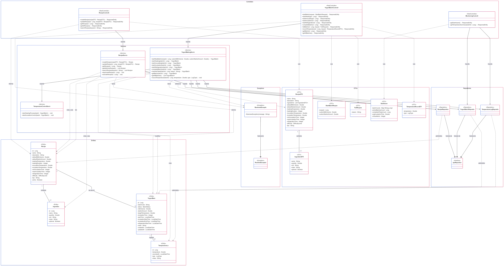

# 🥛 Yogurt Maker API


🔗 **Repositorio GitHub:** [https://github.com/kevinienriquezr-arch/yogurt.git](https://github.com/kevinienriquezr-arch/yogurt.git)  
🌐 **API en Vivo (Swagger UI):** [https://yogurt-app.onrender.com/swagger-ui/index.html](https://yogurt-app.onrender.com/swagger-ui/index.html)

---

## 📖 ¿Qué es esta aplicación?

**Yogurt Maker API** es un sistema backend RESTful profesional diseñado para simular y automatizar la **producción industrial o casera de yogurt**. 

Su objetivo principal es permitir a los usuarios crear recetas personalizadas y lanzar "lotes de producción" (batches) basados en esas recetas. El sistema realiza un seguimiento meticuloso de cada fase de fabricación (desde la preparación y el calentamiento, hasta la incubación y la refrigeración final). Además, cuenta con un sistema de registro de temperaturas para evaluar la calidad del lote y un panel de monitoreo en tiempo real.

## 🛠️ Tecnologías y Dependencias

El proyecto fue construido bajo los principios de Arquitectura Limpia (Clean Architecture) e inyección de dependencias, utilizando el siguiente stack tecnológico:

- **Java 21:** Lenguaje de programación principal orientado a objetos.
- **Spring Boot 3.x:** Framework core para la creación ágil del proyecto.
  - *Spring WebMVC:* Módulo para la creación de los controladores y endpoints de la API RESTful.
  - *Spring Data JPA:* Módulo para el mapeo objeto-relacional (ORM) y la persistencia de datos.
- **H2 Database:** Base de datos relacional SQL en memoria. Permite almacenar datos durante la vida de la aplicación de forma ultrarrápida, ideal para pruebas de concepto, despliegues en la nube sin costo y demostraciones académicas.
- **Swagger (SpringDoc OpenAPI):** Librería que autogenera una interfaz gráfica e interactiva para documentar y probar la API desde el navegador.
- **Lombok:** Herramienta clave para reducir el código repetitivo en Java (autogenerando constructores, getters y setters).
- **Maven:** Gestor de construcción y dependencias del proyecto (`pom.xml`).
- **Docker:** Plataforma de containerización usada para empaquetar la aplicación y asegurar su funcionamiento en cualquier entorno (incluyendo Render).

## 🚀 Funcionalidades Principales y Endpoints

La aplicación divide sus capacidades en 3 controladores principales que exponen los siguientes endpoints:

### 1. Gestión de Recetas (`/api/recipes`)
Administra los ingredientes y las instrucciones matemáticas (tiempos y temperaturas ideales) para hacer yogurt.
- `POST /api/recipes` — Crear una receta nueva.
- `GET /api/recipes/{id}` — Ver el detalle de una receta específica.
- `GET /api/recipes` — Listar todas las recetas activas.
- `GET /api/recipes/search` — Buscar una receta por palabra clave (keyword).

### 2. Control de Lotes de Producción (`/api/batches`)
El motor principal. Controla el avance físico de un lote de leche que se está convirtiendo en yogurt.
- `POST /api/batches/start` — Inicia un nuevo lote de producción usando el ID de una receta.
- `POST /api/batches/{id}/heat` — Avanza el estado del lote a: **Calentamiento**.
- `POST /api/batches/{id}/inoculate` — Avanza el estado del lote a: **Inoculación** (agregar cultivo).
- `POST /api/batches/{id}/incubate` — Avanza el estado del lote a: **Incubación**.
- `POST /api/batches/{id}/refrigerate` — Avanza el estado del lote a: **Refrigeración**.
- `POST /api/batches/{id}/complete` — Marca el proceso como **Completado** exitosamente.
- `POST /api/batches/{id}/temperature` — Registra una lectura del termómetro para este lote en la base de datos.

### 3. Panel de Control y Monitoreo (`/api/monitoring`)
Sistema de vigilancia para el gerente de la fábrica.
- `GET /api/monitoring/dashboard` — Retorna un resumen en vivo (ej. cantidad de lotes activos hoy, tiempos promedios de incubación y cantidad de alertas críticas).

---

## 📂 Organización del Proyecto

El código fuente respeta la Separación de Responsabilidades (SRP), estructurado jerárquicamente de la siguiente manera, sin omitir ningún archivo crítico:

```text
src/main/
├── java/com/kevin/demo/
│   ├── domain/
│   │   ├── controller/      
│   │   │   ├── MonitoringController.java
│   │   │   ├── RecipeController.java
│   │   │   └── YogurtBatchController.java
│   │   ├── model/           
│   │   │   ├── Ingredient.java
│   │   │   ├── Recipe.java
│   │   │   ├── TemperatureLog.java
│   │   │   └── YogurtBatch.java
│   │   ├── repository/      
│   │   │   ├── RecipeRepository.java
│   │   │   ├── TemperatureLogRepository.java
│   │   │   └── YogurtBatchRepository.java
│   │   └── service/         
│   │       ├── RecipeService.java
│   │       ├── TemperatureControlService.java
│   │       └── YogurtMakingService.java
│   ├── dto/                 
│   │   ├── BatchDTO.java
│   │   ├── IngredientDTO.java
│   │   ├── MonitoringDTO.java
│   │   ├── RecipeDTO.java
│   │   └── TemperatureRecordDTO.java
│   └── exception/           
│       ├── BusinessException.java
│       └── GlobalExceptionHandler.java
└── resources/
    └── application.properties
```

## 🏛️ Arquitectura del Sistema (UML)

<div align="center">
  
</div>

El diagrama de la aplicación refleja el Principio de Responsabilidad Única dividiendo el sistema en cuatro capas, enlazadas jerárquicamente mediante inyección de dependencias (flechas continuas `-->`):

1. **Controllers:** Puertas de entrada HTTP. Manipulan exclusivamente `DTOs` para recibir datos de internet de forma segura sin exponer la base de datos.
2. **Services:** El "cerebro" de la fábrica. Toman los datos de los DTOs, aplican la lógica de negocio y fabrican las `Entities`.
3. **Repositories:** Guardan la información. Utilizan flechas de herencia huecas (`--|>`) para conectarse a `JpaRepository`, heredando de allí todas las sentencias SQL automáticamente.
4. **Entities:** Representan las tablas de datos puras en memoria.
5. **Exceptions:** Guardaespaldas del sistema. Heredan (`--|>`) de `RuntimeException` para detener procesos inmediatamente y proteger la aplicación si el Service detecta reglas rotas.

## ☁️ Estrategia de Despliegue en Render

Dado que la capa gratuita de la plataforma Render no ofrece un entorno nativo directo para ejecutar proyectos compilados puramente en Java, la solución implementada fue la **containerización mediante Docker**.

**Flujo de Despliegue Automático:**
No fue necesario construir imágenes manualmente en la computadora local ni crear repositorios externos en DockerHub. Únicamente se redactó un archivo `Dockerfile` en la raíz del código fuente que contiene las directrices básicas (imagen base de Java 21, copiado del ejecutable compilado por Maven y exposición del puerto 8080). 

Al enlazar el repositorio de GitHub con Render, la plataforma detectó este `Dockerfile`, construyó la imagen del contenedor por su propia cuenta de forma automatizada y desplegó exitosamente la API. Esto permite un flujo de integración continua: cada nuevo "push" a la rama `main` en GitHub actualiza la aplicación en vivo.

> ⚠️ **Aviso sobre la Base de Datos:** Este proyecto utiliza la base de datos **H2 en memoria** (`jdbc:h2:mem:yogurtdb`) para propósitos de prueba ágil. Debido a esta arquitectura volátil, cada vez que el contenedor en Render entre en suspensión o se reinicie, **los datos almacenados se limpiarán**.

## ⚙️ Instalación Local

Para correr el proyecto en tu máquina (sin usar Docker):

1. Clona el repositorio:
   ```bash
   git clone https://github.com/kevinienriquezr-arch/yogurt.git
   cd yogurt
   ```
2. Ejecuta la aplicación usando el wrapper de Maven:
   ```bash
   ./mvnw spring-boot:run
   ```
3. Accede a la documentación local interactiva en tu navegador: `http://localhost:8080/swagger-ui/index.html`

## 📖 Pruebas de la API

Para revisar ejemplos prácticos (con formato JSON) y tutoriales de cómo llamar a cada endpoint desde Postman o Swagger, por favor consulta el manual en la carpeta `/docs` de este repositorio:
- [Manual de Usuario - Pruebas API](docs/MANUAL_USUARIO.md)

## 📄 Licencia

Este proyecto está bajo la Licencia MIT - ver el archivo [LICENSE](LICENSE) para más detalles.
