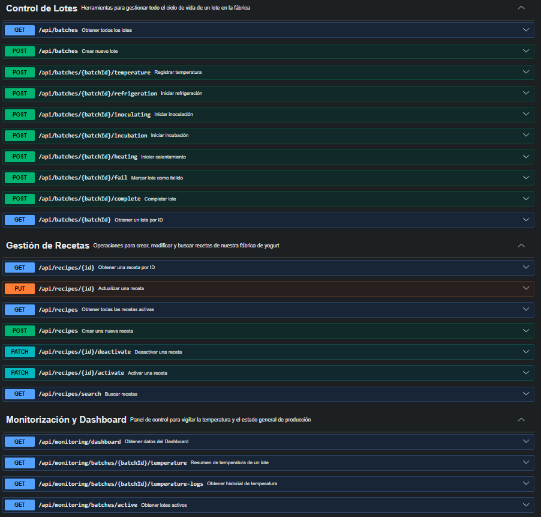
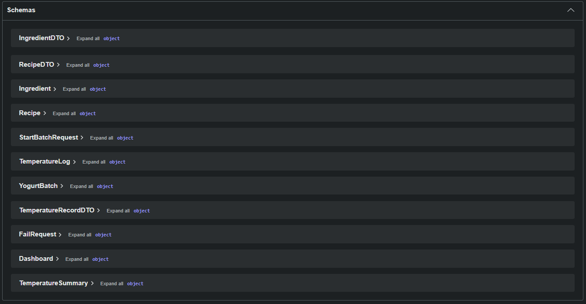
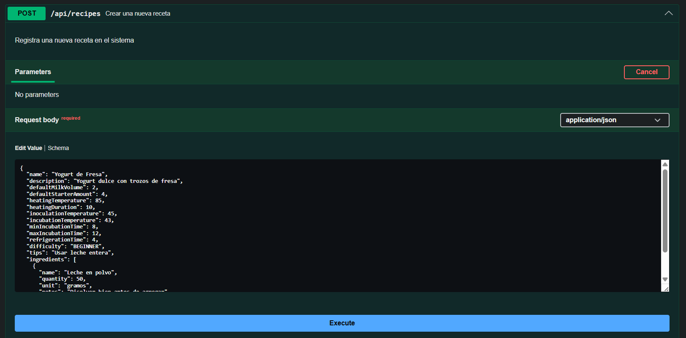
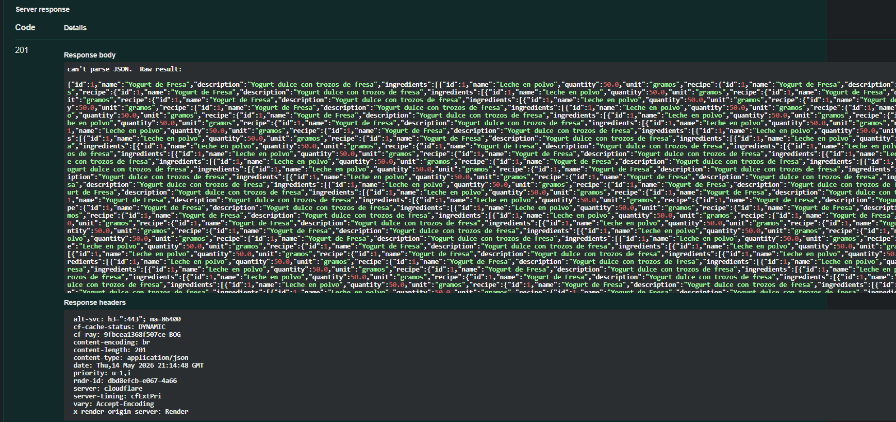

# 📖 Manual de Usuario - API Yogurt Maker

Bienvenido al manual operativo de tu fábrica virtual de yogurt. Esta guía te llevará paso a paso a través del flujo ideal de producción para que puedas aprovechar al máximo nuestra API y evitar bloqueos en el sistema.

## 🚀 Primeros Pasos: Acceso al Sistema

Para comenzar a interactuar con la aplicación de forma inmediata y visual, accede a nuestra interfaz gráfica oficial alojada en la nube:

👉 **[Abrir Panel Interactivo de Swagger UI (Render)](https://yogurt-app.onrender.com/swagger-ui/index.html)**

Al ingresar, notarás que la API está organizada en **3 secciones principales**:



1. **Recetas (Recipe Controller):** Gestión de fórmulas maestras.
2. **Lotes de Producción (Yogurt Batch Controller):** Control del progreso físico de la leche transformándose en yogurt.
3. **Monitoreo (Monitoring Controller):** Panel de estadísticas en vivo.

Además, en la parte inferior de la página de Swagger encontrarás la sección de **Schemas**, donde se detalla la estructura técnica de todas las entidades del sistema:



---

## 🏭 El Flujo de Producción Exitoso (Paso a Paso)

Nuestra API es tan robusta que **simula el proceso térmico en tiempo real en segundo plano**. Esto significa que los lotes no avanzan mágicamente con solo dar clics rápidos; el sistema bloquea los avances si no se ha esperado el enfriamiento o calentamiento virtual.

A continuación, el flujo ultra detallado para completar un lote con éxito sin recibir errores (usaremos tiempos de prueba para no tener que esperar horas):

### Paso 1: Crear una Receta (Especial para Pruebas Rápidas)
Para probar la API sin que los hilos de simulación te hagan esperar demasiado, crearemos una receta con tiempos reducidos. Usa el endpoint **`POST /api/recipes`**.

<details>
<summary>📋 Clic para ver el JSON (Cópialo y Pégalo en Swagger)</summary>

```json
{
  "name": "Yogurt de Prueba Rápida",
  "description": "Receta con tiempos y temperaturas cortas para probar la API sin bloqueos de tiempo",
  "defaultMilkVolume": 100.0,
  "defaultStarterAmount": 2.5,
  "heatingTemperature": 30.0,
  "heatingDuration": 0, 
  "inoculationTemperature": 25.0,
  "incubationTemperature": 25.0,
  "minIncubationTime": 0,
  "maxIncubationTime": 1,
  "refrigerationTime": 0,
  "difficulty": "BEGINNER",
  "tips": "Ideal para demostraciones",
  "ingredients": [
    { "name": "Leche", "quantity": 100, "unit": "L", "optional": false }
  ]
}
```
</details>

Al ejecutar esta petición (`Execute`), verás cómo se envían los datos al servidor y cómo este te responde con el código `201 Created`.

**Ejemplo visual de la Petición (Request):**


**Ejemplo visual de la Respuesta Exitosa (Response):**


*(Como verás, el sistema te devolverá tu receta creada con un ID único. Supongamos que es el `"id": 1`)*.

### Paso 2: Iniciar el Lote (Nace en estado PREPARING)
Ve al controlador de Lotes y usa **`POST /api/batches/start`**. Pásale el ID de la receta que acabas de crear.

<details>
<summary>📋 JSON para iniciar el lote</summary>

```json
{
  "recipeId": 1,
  "customMilkVolume": 150.0,
  "customStarterAmount": 3.0
}
```
</details>

*(El sistema te devolverá el Lote que acaba de nacer. Supongamos que tu lote es el ID 1).*

### Paso 3: Ordenar el Calentamiento (HEATING)
Llama al endpoint **`POST /api/batches/1/heat`**.
> ⚠️ **¡ALERTA DE SIMULADOR!** A partir de este momento, un hilo en segundo plano (Background Thread) tomará el control del servidor. Comenzará a subir la temperatura virtualmente, y cuando alcance la meta, la enfriará automáticamente. 
> 
> **No intentes avanzar todavía.** Si llamas a la Inoculación inmediatamente, el sistema te arrojará un error 400. Debes usar **`GET /api/batches/1`** varias veces y esperar a que el atributo `"status"` cambie automáticamente de `"HEATING"` a `"COOLING"`. *(Con la receta rápida que usamos, esto tardará unos segundos).*

### Paso 4: Inoculación (INOCULATING)
Una vez que `GET /api/batches/1` te confirme que la leche ya está en `"COOLING"` (enfriada y lista), añade los cultivos lácticos llamando a **`POST /api/batches/1/inoculate`**.

### Paso 5: Incubación (INCUBATING)
Ahora, llama a **`POST /api/batches/1/incubate`**.
Durante esta fase (y también en las anteriores), si tuvieras termómetros IoT conectados, enviarían datos con el siguiente endpoint. Puedes simularlo enviando este JSON a **`POST /api/batches/1/temperature`**:
```json
{
  "temperature": 25.5,
  "type": "INCUBATION"
}
```

### Paso 6: Refrigeración (REFRIGERATING) y Completado (COMPLETED)
Una vez transcurrido el tiempo mínimo de incubación establecido en la receta (que configuramos en 0 para esta prueba), procede a enviarlo a la nevera con **`POST /api/batches/1/refrigerate`**.
Finalmente, cuando termine el tiempo de frío, llama a **`POST /api/batches/1/complete`**.

¡Felicidades! Has operado la fábrica sin romper las leyes termodinámicas del simulador.

---

## 🔍 Buenas Prácticas: Búsquedas, Actualización y Eliminación

*   **Búsquedas Eficientes:** Si en un futuro tienes decenas de recetas, no satures la red. Utiliza la ruta de búsqueda inteligente **`GET /api/recipes/search`** pasando una palabra clave como "fresa".
*   **Actualizaciones Seguras (`PUT`):** Al actualizar datos de una receta (**`PUT /api/recipes/{id}`**), debes enviar el JSON íntegro. Si omites campos, el sistema podría sobrescribirlos con valores nulos o vacíos.
*   **Eliminación Protectora (Soft Delete):** Para mantener la trazabilidad de lotes antiguos, el sistema no hace borrados físicos destructivos. Al llamar a **`DELETE /api/recipes/{id}`**, la receta simplemente pasa a un estado inactivo. Esto evita que pueda usarse para lotes nuevos, pero salvaguarda el historial de la base de datos.

---

## 🚦 Diccionario de Códigos de Respuesta HTTP (Errores)

Al presionar "Execute" en Swagger, revisa siempre el bloque "Server response" para saber qué código numérico arrojó tu operación:

### ✅ Operaciones Exitosas
*   **`200 OK`**: La solicitud fue exitosa. Lo verás al consultar un lote o al lograr avanzar de estado exitosamente.
*   **`201 Created`**: Creación confirmada. Indica que el registro se guardó permanentemente en la memoria (Ej. Creaste una receta o empezaste un lote).

### ❌ Errores Operativos (Del Usuario)
*   **`400 Bad Request`**: **El código que más verás si no sigues los pasos físicos.** Significa que rompiste una regla de negocio del código. 
    *   *Ejemplo 1:* Intentaste llamar a `/inoculate` cuando el estado seguía en `HEATING` y aún no llegaba a `COOLING`.
    *   *Ejemplo 2:* Llamaste a `/refrigerate` antes de que se cumpliera el tiempo configurado de incubación.
    *   *(Tip: Lee siempre el mensaje que devuelve el error 400, ahí el `YogurtMakingService` te regañará explicándote el motivo exacto).*
*   **`404 Not Found`**: El ID que intentas consultar o alterar no existe. (Ej. Tratas de calentar el lote número 99 cuando solo existe 1).

### 💥 Errores del Servidor
*   **`500 Internal Server Error`**: Ocurrió un fallo en los hilos (Threads) del simulador o en la plataforma Render. (Nuestro `GlobalExceptionHandler` se encarga de que la aplicación no colapse del todo si esto ocurre).
